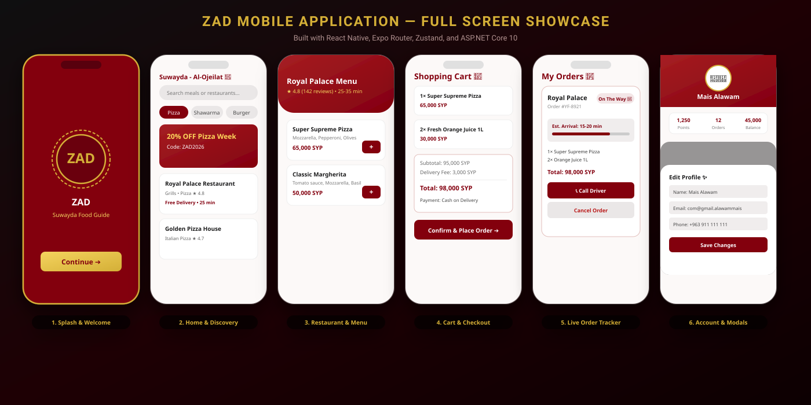

# 🍕 ZAD — Food Delivery Platform (تطبيق زاد لتوصيل الطعام)


**ZAD (زاد)** is a full-stack, enterprise-grade food delivery application built for Suwayda, Syria. It connects hungry customers with top local restaurants, featuring a sleek React Native mobile interface, real-time order status tracking, digital wallet management, and a robust ASP.NET Core 10 backend API.

---

## 📱 Application Interfaces & Animations (واجهات التطبيق والرسوم المتحركة)



### 🎨 Key Mobile Screens & Motion Highlights:

#### 1️⃣ Animated Splash Screen (`src/app/index.tsx`)
- **Pulsing Golden Halo**: Reanimated 4 looping rotation and scale effects surrounding the ZAD brand emblem.
- **Floating ZAD Logo**: Quadratic easing animation providing a dynamic, tactile feel.
- **Staggered Entrance**: Delayed fade-in for taglines and the interactive continue button.

#### 2️⃣ Home & Fast Food Feed (`src/app/(tabs)/home.tsx`)
- **Dynamic Category Selector**: Filter food items instantly (Pizza, Shawarma, Burger, Grills, Sweets, Drinks).
- **Promotional Banners**: Animated discount banners with gold accent highlights.
- **Restaurant Cards**: Ratings, cuisine tags, distance indicators, and free delivery badges.

#### 3️⃣ Real-Time Live Order Tracker (`src/app/(tabs)/orders.tsx`)
- **Step-by-Step Status Bar**: Live visual tracking (`Order Received ➔ Preparing 👨‍🍳 ➔ Out for Delivery 🛵 ➔ Delivered 🎉`).
- **Driver Hotline**: Direct tap-to-call delivery driver button (`📞 الاتصال بالسائق`).
- **Interactive Re-Ordering**: One-tap re-order button to populate the cart with previous orders.

#### 4️⃣ Profile & Interactive Bottom Modals (`src/app/(tabs)/profile.tsx`)
- **Edit Profile Modal**: Modify name, email, phone, and avatar presets with instant store sync.
- **Delivery Addresses Modal**: Manage multiple delivery locations, add new addresses, and set default defaults.
- **Payment & Wallet Modal**: Select payment options (COD, Syriatel Cash, Card) and top up wallet (+10,000, +25,000, +50,000 SYP).
- **Golden Rewards Modal**: Redeem 1,000 points for an instant 10,000 SYP wallet credit.
- **Help Center & Contact Us Modals**: Expandable accordion FAQs, WhatsApp support, and customer hotline.

---

## 🌟 Feature Overview

- 🍕 **Multi-Category Browsing**: Explore Pizza, Shawarma, Burgers, Broasted Chicken, Grills, Sweets, and Beverages.
- 🛒 **Interactive Shopping Cart**: Dynamic item quantity updates, customized invoice breakdown, and estimated delivery fees.
- 🛵 **Real-time Order Tracking**: Live status workflow (`Preparing 👨‍🍳` ➔ `Out for Delivery 🛵` ➔ `Delivered 🎉`).
- 💳 **Local Payment Integration**: Support for Cash on Delivery (COD), ZAD Digital Wallet, Syriatel Cash, and Bank Cards.
- 🌟 **Golden Rewards Program**: Earn points on every order (10 points per 1,000 L.S) and redeem 1,000 points for instant 10,000 L.S wallet credit.
- 👤 **Full Account & Profile Controls**: Manage multiple delivery addresses, edit user profile details, top up wallet balance, and save favorite restaurants.

---

## 🏗️ System Architecture

```text
zad/
├── assets/                         # Documentation graphics & app SVG previews
│   └── docs/app_preview.svg
│
├── backend/                        # ASP.NET Core 10 Web API
│   ├── YallaFood.Api/              # API Controllers, Middlewares, Program.cs
│   ├── YallaFood.Application/      # CQRS Services, DTOs, Validators
│   ├── YallaFood.Domain/           # Entities (User, Order, Restaurant, Product, Category)
│   ├── YallaFood.Infrastructure/   # EF Core DbContext, Migrations, Seed Data
│   └── YallaFood.slnx              # Solution file
│
└── zad-app/                        # Cross-Platform Mobile App
    ├── src/
    │   ├── app/                    # Expo Router file-based pages (tabs, cart, onboarding)
    │   ├── components/             # Reusable UI Cards & Headers
    │   ├── features/               # Feature-specific Modals (Profile, Addresses, Wallet)
    │   ├── store/                  # Zustand global state (Auth, Cart, Orders, Favorites)
    │   └── theme/                  # Design Tokens (Colors, Typography, Spacing)
    └── package.json
```

---

## ⚙️ Tech Stack & Libraries

### 📱 Frontend (Mobile App)
- **Framework**: [Expo](https://expo.dev) (v54) & **React Native** (v0.81)
- **Navigation**: **Expo Router** (File-based navigation)
- **State Management**: **Zustand**
- **Animations**: **React Native Reanimated 4**
- **Icons & UI**: `@expo/vector-icons` & **Expo Linear Gradient**
- **Language**: **TypeScript**

### 🔌 Backend (API & Database)
- **Framework**: **ASP.NET Core 10 Web API**
- **Database**: **SQL Server** via **Entity Framework Core 10**
- **Architecture**: **Clean Architecture & DDD Principles**
- **Logging**: **Serilog** structured logging
- **API Documentation**: **Swagger / OpenAPI**

---

## 📡 Key API Endpoints

| Method | Endpoint | Description |
| :--- | :--- | :--- |
| `POST` | `/api/v1/auth/login` | User authentication & JWT token |
| `GET` | `/api/v1/restaurants` | List all active restaurants with ratings & distance |
| `GET` | `/api/v1/products/category/{id}` | Filter products by category |
| `POST` | `/api/v1/orders` | Create a new food order |
| `GET` | `/api/v1/orders/user/{id}` | Get user order history & active orders |
| `PUT` | `/api/v1/user/profile` | Update user profile and delivery addresses |

---

## 🚀 Quick Start Guide

### Prerequisites
- [Node.js](https://nodejs.org/) (v18 or higher)
- [.NET 10 SDK](https://dotnet.microsoft.com/)
- [SQL Server LocalDB](https://learn.microsoft.com/en-us/sql/database-engine/configure-windows/sql-server-express-localdb)

### 1. Run Backend API

```bash
cd backend/YallaFood.Api
dotnet run
```
> The API server will start listening on `http://localhost:5086` and Swagger documentation will be available at `http://localhost:5086/swagger`.

### 2. Run Mobile App

```bash
cd zad-app
npm install
npx expo start
```
> Press `w` to open in Web browser, `a` for Android Emulator, or scan the QR code using the Expo Go app on your mobile device.

---

## 👤 Author & Maintainer

Developed with ❤️ for Suwayda by **Mais Alawam** ([@alawammais0-crypto](https://github.com/alawammais0-crypto)).

---

## 📄 License

This project is licensed under the **MIT License**.
